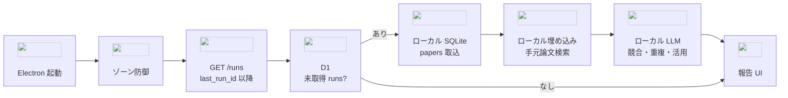

# ADR-0001: 実行形態・ローカルデータ・拡張点

- **ステータス**: 承認済み / **日付**: 2026-09-19
- **要件**: FR-01〜03, FR-06, FR-09, NFR-01/02/05, C-01, C-05

## 決定

### 二層

| | クラウド (Workers Cron + D1) | デスクトップ (Electron + TS) | CLI（共有コア） |
|---|---|---|---|
| 役割 | 日次収集・粗いスコア・レポート蓄積 | プル同期、精密判定、テーマ、ライブラリ、FC | ライブラリ等 |
| データ | 公開のみ（研究プロフィール含む） | 未公開 RAG・原稿・**ライブラリ** | **同じローカルストア** |

同期は起動時プルのみ。Python は実行時必須にしない。Workers と型・スキーマ共有。
GUI と CLI は共有コア越しに同一データを触る（二重管理しない）。

### 起動時同期 → 競合／重複検査（成功条件 2 / FR-02）

Electron（または同等のデスクトップ起動）で次を順に行う。**未取得の `runs` が無いときはプルも判定もスキップ。**
クラウドへ判定結果を書き戻さない（`C-01`）。手元論文の本文・埋め込みは端末内だけ。

手順:

1. **起動** — 認証済みなら同期 API を呼ぶ（経路は [ADR-0004](0004-cloudflare-edge-and-scheduling.md)）
2. **未取得確認** — ローカル `projects.last_run_id` より後の `runs` / `run_papers` が D1 にあるか見る
3. **プル** — あれば公開候補だけをローカル `papers` に取り込む。`last_run_id` を進める。失敗と 0 件は区別して残す（`FR-08`）
4. **手元検索** — 取り込んだ各候補を、ローカル埋め込みで自分の論文・原稿索引と照合（`FR-03`, `C-01`）
5. **ローカル LLM** — 近傍ヒットを材料に、**競合／重複／活用／無関連**を判定する。未公開本文は端末外に出さない。外部 BFF（C2）はこの工程の本線にしない
6. **報告** — 判定を行に保存し、起動後に読める報告にする（成功条件 2）。ライブラリ追加はユーザー操作（`FR-05`）

CLI からも同じ共有コアで「同期＋判定」を実行できる（`FR-11`）。GUI 必須にしない。

### 関連度・テーマ

1. クラウドでプロフィールにより緩めに絞る → **起動後にローカル RAG＋ローカル LLM で精密判定**（上節）
2. テーマ候補はデスクトップ起動後に生成（cron は候補集合まで）。テーマ生成の既定経路は C2（公開＋プロフィール、ADR-0002）。競合検査とは別工程

### ローカル RAG

- 埋め込みはローカルのみ（Transformers.js）。埋め込み API 禁止
- ローカル保存は SQLite 1 ファイル＋`sqlite-vec`（組込み・サーバー不要）。メタとベクトルを同一トランザクションで扱う
- 1 プロジェクト = やりたいこと 1 つ = 埋め込みモデル 1 つ。モデル変更時は再索引。未公開データはローカル推論のみ
- 論文ベクトルは保存せず判定時に同モデルで計算。モデルは設定（分野名をコードに埋めない）
- **競合／重複の精密判定はローカル LLM。** 埋め込みは候補の絞り込み、LLM はラベル付け。どちらもローカル（`C-01`）
- クラウドに出すユーザー情報はプロジェクト概要（`summary`）のみ

### データ配置（ER 図は [er-diagram.md](../er-diagram.md)）

境界: **クラウドは「誰の・どのプロジェクトに・いつ・何が集まったか」まで。
論文への判断と手元の文章はローカル。**

- クラウドに出るユーザー情報は**プロジェクト概要（`summary`）のみ**。
  日次収集が何を集めるか判断する唯一の材料であり、同時に唯一の流出面
- クラウドは**ユーザー名・メールを持たない**。本人確認は OAuth subject のみ
- **クラウドに論文マスタ表を作らない。** 収集実行の行に論文情報を直接持つ。
  実行ごとに重複するが、結合を減らし保持期間の管理を単純にする
- 収集実行は `ok / empty / failed / partial` を区別し、欠けた依存だけを記録する（`FR-08`, `C-07`）
- 同期位置はローカルのプロジェクト行が持つ（`last_run_id`）。設定には置かない
- 判定結果・ライブラリの保存状態は行が自分で持つ。**別のキュー表を作らない**
- 秘密（更新トークン等）は Electron `safeStorage` で暗号化して設定表に入れる。
  ネイティブ依存を増やさないため（`NFR-05`）。
  **DB ファイル自体は暗号化されない**——同一 PC の同一ユーザー権限からは復号できる
- アクセストークンは保存しない（メモリのみ）

保存しないもの: テーマ候補（`papers` から都度生成）、FC 結果（未決）、
埋め込み空間表（プロジェクト行の 1 モデルで足りる）。

### 拡張

- 論文ソースはアダプタ + `capabilities`。プロジェクト／`user_id` 次元を最初から持つ

### 障害

- 欠けた依存だけ欠落表示。「0件」と「取得失敗」を区別。レポートは一意 ID
- LLM は OpenAI 互換に閉じ、差替えは BFF 内に局所化

却下: ローカル cron のみ / クラウド完結 / personal を外部索引化 / SQLite＋LanceDB 併用（ネイティブ依存 2 つ・二重ストア整合） / **競合検査で手元論文を BFF・外部 LLM に送る**
