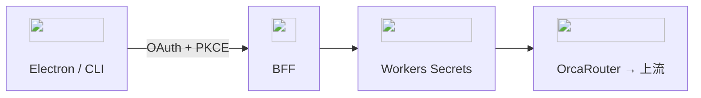

# ADR-0002: 外部 LLM・BFF・データ分類

- **ステータス**: 承認済み / **日付**: 2026-09-19
- **要件**: FR-10, C-02, C-03, C-04, C-06, NFR-04

## 決定

外部 LLM 利用自体がプロダクト目的に含まれる（成功条件 5）。

- 全 LLM は OrcaRouter。キー `cron` / `interactive` / `sensitive`。クライアントに置かない
- 機能ごと endpoint。自由プロキシ禁止。監査に本文を残さない
- ゲートウェイゼロ保持は自社のみ → 「残らない」と説明しない

| | C1 | C2 | C3 |
|---|---|---|---|
| 用途例 | トレンド | テーマ候補の既定 | ファクトチェック |
| モデル | auto可 | 許可リスト | **固定・FB無効** |
| 同意 | 不要 | 初回 | プレビュー必須。範囲を偽らない |
| その他 | | | 機能ごと完全オフ可。`fail_open: false` |

分類は BFF が機能で決める。新機能は分類決定後に endpoint。
**競合／重複検査（FR-02）はローカル LLM**（ADR-0001）。手元論文を BFF に載せない。

却下: キー同梱 / ゼロ保持 alone で C3 許可 / **競合検査を C2 本線にする**
