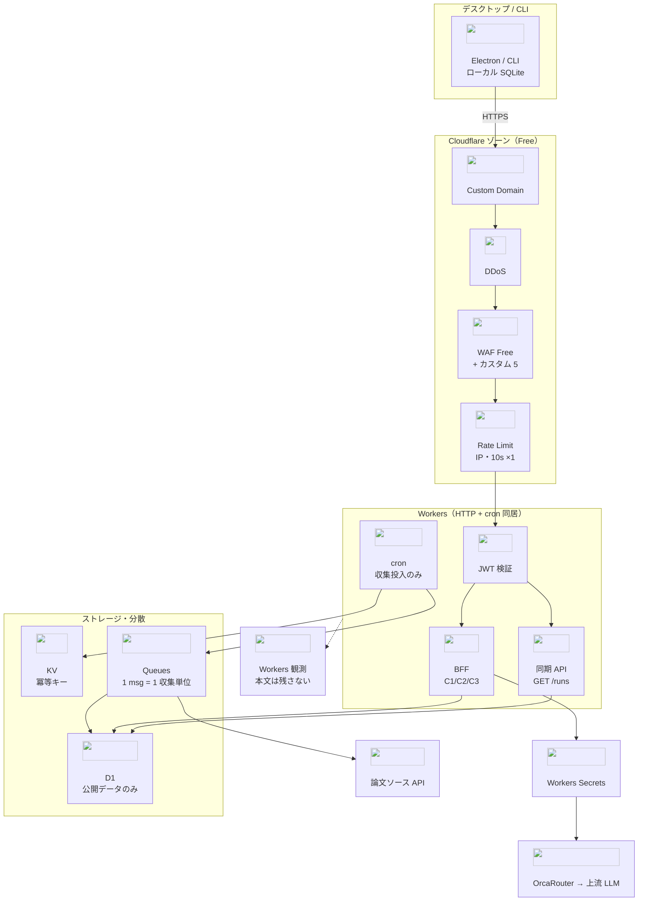
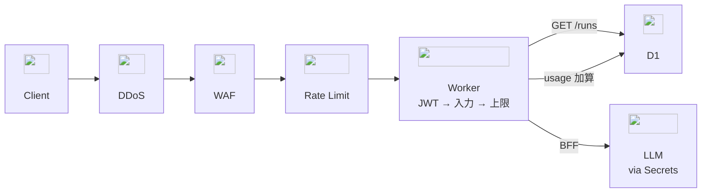
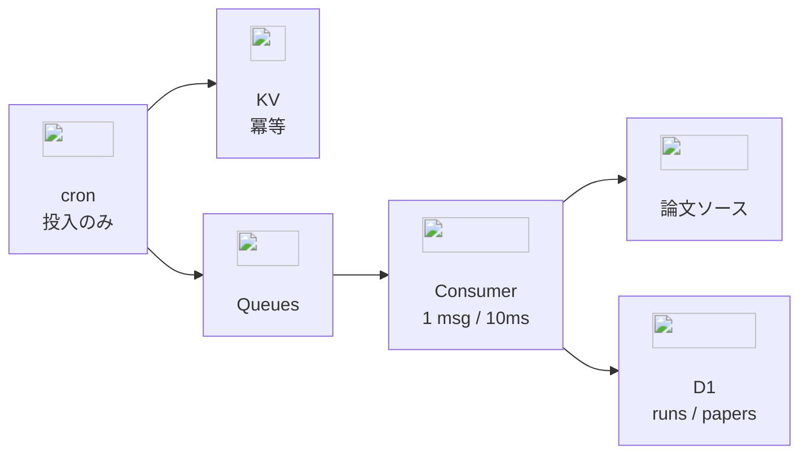
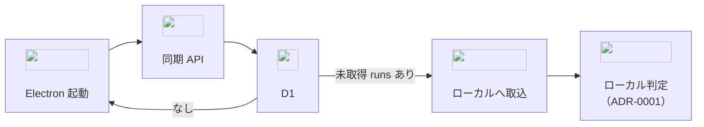

# ADR-0004: クラウド側インフラ全体構成（無料枠前提）

- **ステータス**: 提案 / **日付**: 2026-09-20（同日改訂: 148行目の陳腐化した「ローカル LLM で競合／重複検査」記述を訂正／改訂 2026-09-21: 上流は GitHub OAuth／同日: 書誌補完 BFF を責務から外さない／同日: 上流を Google OAuth に変更／同日: Claude scan 用に `test` 環境を `dev`/`prod` から分離）
- **要件**: FR-01, FR-02, FR-08, FR-10, C-02, C-04, C-06, NFR-01, NFR-04
- **前提**: [ADR-0001](0001-runtime-local-data-extensibility.md)（二層・データ配置）、[ADR-0002](0002-external-llm-bff-classification.md)（BFF・分類）

ローカル側は [ADR-0001](0001-runtime-local-data-extensibility.md) / [ADR-0003](0003-references-and-manuscript-factcheck.md)。本 ADR はクラウド側だけを扱う。

## クラウドが負う責務

| 要件 | クラウドでやること |
|---|---|
| FR-01, NFR-01 | アプリ未起動でも日次収集する |
| FR-08 | 「0 件」と「取得失敗」を区別して残す |
| FR-02 | 溜めた候補を起動時に渡す（プル） |
| FR-10, C-04, C-06 | LLM を BFF 経由に閉じ、鍵をクライアントに出さない |
| NFR-04 | 利用者単位の上限を数えて止める |

ライブラリの保存・PDF・書き出し・CLI（FR-05/11/12/14）と FC（FR-04）はローカル完結。
公開書誌の穴埋めだけ BFF が関与する（ADR-0002 C1）。テーマ生成も BFF（C2）。

## 決定

**ゾーン・Workers とも Free プランで成立させる。** 固定費は上流 LLM の従量課金（ADR-0002）だけにする。

### 全体構成

アイコンは [cf-icons](https://cf-icons.pages.dev/)（`https://cf-icons.pages.dev/<name>.svg`）。

#### リクエスト経路（同期 / BFF）

#### 日次収集経路（cron → Queues）

### 構成要素と選定理由

| 要素 | 使うもの | 理由 |
|---|---|---|
| 実行 | Workers（1 Worker に HTTP と cron を同居） | ランタイムを増やさない（NFR-05）。Worker を分けると設定と型が二重になる |
| 保存 | D1 | 公開データのみで量が小さく、関係で引ければ足りる |
| 分散 | Queues | CPU 10ms 制約の回避（後述）。Free でも使える |
| 冪等 | KV | 実行 ID の重複判定。書き込みが少なく Free 枠に収まる |
| 秘密 | Workers Secrets | 鍵をクライアントに置かない（C-06） |
| 公開面 | ゾーン配下の独自ドメイン | `workers.dev` は公式に「Free website 扱い」。防御の前提にしない |

**使わないもの**: API Shield（Enterprise アドオン）、Health Checks（Pro 以上・cron 不発を検知できない）、R2（保存する大きな成果物がない）、Durable Objects（無料枠の条件を未確認のため初版では採らない）。

### 認証（C-02, C-06）

- 上流は **Google OAuth（Authorization Code + PKCE）**。Auth0 / Clerk / Cloudflare Access は置かない。GitHub も初版では足さない（コンソールと client が二重になる）
- コード交換は BFF がする。Google の `client_secret` は Workers Secrets。Electron には `client_id` だけ置く（`C-06`, `C-02`）
- Google の OpenID `sub` を確認したあと、**自前の短命 JWT** を発行する（ADR-0002）。Google の access を API の Bearer にしない
- `users.oauth_subject` は `google:{sub}`。名前・メールは持たない。scope は `openid` のみ。`email` / `profile` は要求しない（ADR-0001）
- トークンの置き場はクライアント側（ADR-0001）。Worker は `Authorization: Bearer` を検証するだけ。
  Cookie でセッションを持たない（Electron / CLI で Cookie jar を共有できない）
- JWT 検証は Worker 内で行う（API Shield を使わないため）。実装は `jose`
- 署名鍵は Workers Secrets。鍵の入れ替え手順は未決

### 日次収集（FR-01, FR-08, NFR-01）

**CPU 時間 10ms／1 実行（HTTP・cron とも）が最大の制約。** 通信の待ち時間は CPU に入らないが、取得結果の解析と採点は入る。

- cron は **Queues への投入だけ**。収集本体はコンシューマで、**1 メッセージ = 1（プロジェクト × ソース）**
  - 実行を分ければ 10ms 枠がメッセージごとに与えられる
- 粗い採点は**文字列一致の水準に留める**。重い判定はローカルへ（ADR-0001）
- **D1 は 1 実行 50 クエリまで（Free）**。1 件ずつ INSERT せず複数行を 1 文にまとめる
- **サブリクエストは 1 実行 50 まで（Free）**。ページングは分割して次のメッセージへ回す
- **UTC のみ**。夏時間の影響を受けない時刻を選ぶ
- **cron・Queues とも at-least-once**。`runs` の一意キーを `(project_id, run_date)` にし、重複実行は無視する
- 失敗と 0 件は `runs.status`、ソース単位の失敗は `failed_sources_json`（FR-08）
- **cron はアカウントで 5 本まで（Free）**。日次収集に使うのは `dev` / `prod` の各 1 本。`test` には付けない。プロジェクトごとに cron を増やす設計にしない

### 同期 API（FR-02 のクラウド側）

- ローカルの `last_run_id` より後の `runs` と `run_papers` を返すだけ（ADR-0001）
- **プル専用**。クラウドへの書き戻し経路を作らない。判定結果は未公開データ由来のため外に出さない（C-01）
- Electron 起動時の「未取得確認 → 取込 → **ローカル**埋め込みで関連度採点」は [ADR-0001](0001-runtime-local-data-extensibility.md) の工程。クラウドは候補の受け渡しまで

#### 起動時プル（クラウドが見る範囲）

### BFF（FR-10, C-04）

- 機能ごとの endpoint。自由プロキシを作らない（ADR-0002）
- 分類（C1/C2/C3）は BFF が決める。C3 は固定モデル・`fail_open: false`
- 同意はクラウドに保存しない。**クライアントが同意バージョンを送り、BFF が検証する**
- 監査に**本文を残さない**。残すのは endpoint・分類・モデル・トークン数

### 利用上限（NFR-04）

- **LLM 呼び出し回数だけを D1 で数える**。HTTP リクエスト全部は数えない
  - 呼び出しは低頻度なので、D1 の 1 日 10 万行書き込み（Free）に収まる
- 上限超過は BFF が止める。エッジのレート制限では利用者単位にできない（Free は IP 基準のみ）

### エッジ防御

1. **DDoS**（常時・設定不要・無料）
2. **WAF Free Managed Ruleset** — `log` で開始し、誤検知を潰してから有効化
3. **WAF カスタムルール（5 本まで）** — 知らない経路・メソッド、過大なリクエストを落とす
   - **正規表現は使えない**（Business 以上）ため `starts_with` 等の文字列演算子で書く
4. **レート制限（1 本）** — 認証前の入口に限る。IP 基準・10 秒窓で NAT 配下を巻き込むため緩い閾値から
5. **Worker 内** — JWT 検証 → 入力検証 → 利用者単位の上限 → 処理

### 監視（FR-08 の裏付け）

- **残すのは実行結果だけ**。失敗と 0 件は `runs.status`、ソース単位の失敗は `failed_sources_json`。ここが FR-08 の実体
- **cron の不発そのものは検知しない**（後述の却下）。収集が止まれば同期で新しい `runs` が来なくなるため、利用者が気づく前提とする
- 実行ログは Workers の観測機能。**LLM の本文は残さない**

### 環境とデプロイ

- wrangler の環境は **`test` / `dev` / `prod`**。**D1 も分ける**（Free で 10 DB まで）
  - `dev` — staging 相当。`push → dev` で載る。人が触る検証
  - `test` — Claude scan と手動検証の隔離環境。**cron は付けない**（日次収集しない。Free の cron 5 本を日次用に残す）。公開面は `workers.dev` のまま（スキャン専用でゾーン防御の対象にしない）
  - `prod` — 本番。`push → main`。公開面はゾーン配下の独自ドメイン
- `test` の D1 には公開論文の fixture だけを seed する。未公開研究は置かない（`C-01`）。scan の本番判断材料にはしない
- `dev` / `prod` のインフラ作成は人が `scripts/bootstrap.sh` を一度だけ走らせる。CI の毎回の push からは作らない
- `test` だけは壊して作り直せるので、手動の `deploy-test` が bootstrap を冪等に走らせてよい
- WAF・レート制限・cron を含めコードで管理（wrangler / Terraform）。手動設定を正にしない
- 配布物に入る値（BFF の URL 等）と秘密を混ぜない。秘密は Workers Secrets のみ

## 無料枠の実測値（2026-09-20 時点・Cloudflare Docs）

### Workers / D1 / Queues

| 項目 | Free | 有料（$5/月〜） |
|---|---|---|
| リクエスト | 10 万/日 | 1,000 万/月込み |
| **CPU 時間（HTTP / cron）** | **10 ms/実行** | 30 秒（既定）／cron は間隔 1 時間以上で 15 分 |
| サブリクエスト | 50/実行 | 1,000〜 |
| cron トリガー | 5/アカウント | 250 |
| D1 読み取り | 500 万行/日 | 250 億行/月込み |
| D1 書き込み | 10 万行/日 | 5,000 万行/月込み |
| D1 容量 | 5 GB（1 DB 500 MB） | 5 GB 込み（1 DB 10 GB） |
| D1 クエリ/実行 | 50 | 1,000 |
| Queues | 1 万操作/日 | 100 万操作/月込み |

### ゾーン（セキュリティ）

| 項目 | Free | Pro |
|---|---|---|
| DDoS 防御 | 常時有効 | 同じ |
| DDoS 上書き | 1 本（カスタム式・`log` 不可） | 同じ |
| WAF カスタムルール | 5（正規表現 不可） | 20 |
| WAF マネージド | Free Managed Ruleset のみ | Cloudflare Managed 等 |
| レート制限ルール | 1（IP のみ・10 秒窓） | 2（最大 1 分） |
| Health Checks | 不可 | 10 |

**DDoS**: 遮断そのものは Free でも自動。差が出るのは「調整」で、Free は上書き 1 本・カスタム式不可・`log` 不可。

## 有料に移る引き金

先回りして払わない。次が起きたら上げる。

| 引き金 | 移行先 |
|---|---|
| 1 実行の CPU が 10ms を超え、分割でも収まらない | Workers 有料 |
| リクエスト 10 万/日、D1 書き込み 10 万行/日に迫る | Workers 有料 |
| cron 5 本、Queues 1 万操作/日で足りない | Workers 有料 |
| WAF カスタム 5 本で足りない／正規表現が要る | ゾーン Pro 以上 |
| 利用者が増え、IP 基準のレート制限で守れない | ゾーン Pro 以上 |

## 却下

- `workers.dev` を**本番の**公開面にする（ゾーンの防御が前提にできない）。`test` はスキャン専用なので `workers.dev` のままにする
- API Shield / Health Checks を前提にする（有料前提となり C-02 と釣り合わない）
- cron 1 実行で全プロジェクトを収集する（CPU 10ms に収まらない）
- プロジェクトごとに cron を増やす（Free は 5 本）
- 判定結果をクラウドへ書き戻す（未公開データ由来。C-01）
- エッジのレート制限だけで利用上限を実現する（Free は IP 基準のみ。NFR-04 を満たせない）
- 収集用と API 用で Worker を分ける（設定と型が二重になる）
- 手動でのゾーン設定運用（再現できない）
- 仲介 IdP（Auth0 / Clerk / Cloudflare Access）や GitHub を初版で並べる（Google 直で足りる。秘密と設定が増える）
- **自己点検 cron で cron 不発を検知する**（不発の頻度が低く、cron 1 本と通知経路を抱える割に合わない）

## 未決

- JWT 署名鍵の入れ替え手順
- 粗い採点をどこまで Worker でやるか（10ms に収まる範囲の見極め）
- `runs` / `run_papers` の保持期間（D1 容量 500 MB/DB に対する見積り）
- Durable Objects の無料枠条件（使えるなら利用上限の実装が単純になる）
- Workers Custom Domain と Route で WAF 適用に差があるか（公式記述を確認できず。導入時に実機確認）
