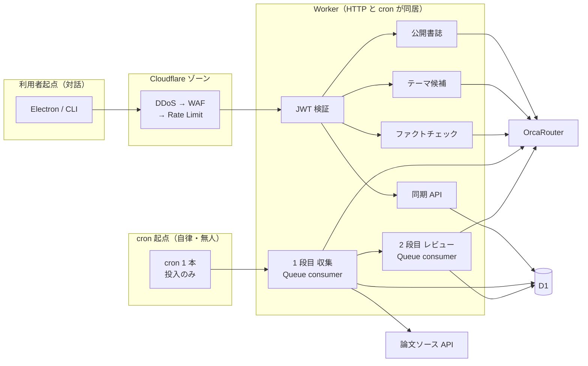
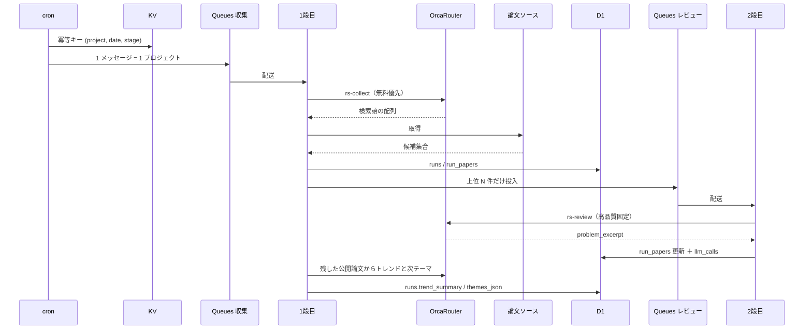
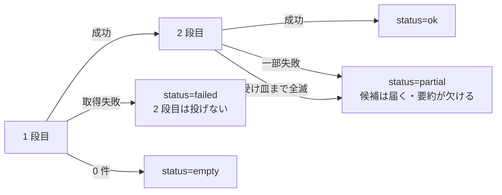
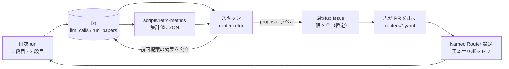

# ADR-0005: クラウド側トレンド調査・競合収集と Named Router によるモデル使い分け

- **ステータス**: 承認済み / **日付**: 2026-09-21（**2026-09-22 改訂: 収集は精度優先。略語 20 件以上を推測して見せ、種語×各略語の AND を順に当てて最新を取る。内部プールから粗い一致の上位 5 件だけを渡す。時間はかけてよい（NFR-01）**／同日改訂: 公開書誌 C1 を利用者起点の LLM 経路に明記／同日: router-retro は `test` D1 の集計 JSON を読む。トークンは Claude に渡さない／同日: 2 段目を課題文抜粋に再定義。関連の二軸に合わせて承認／**同日再改訂: §4 以下、再定義前の `relation`/`reason`/`evidence` 設計を残していた箇所を `problem_excerpt` のみに揃え、依存改訂の要否を見直した（#40）**／**同日: 収集で残した公開論文からトレンドと次テーマを出し、実行行に残す（FR-09）。`POST /theme` は閉じたまま**／**2026-09-23 改訂: `POST /bff/keywords`（設定画面のキーワード推測。C-07 の「分解した語を見せて確認させる」の対話版）を利用者起点 LLM の 4 経路目として明記。1 段目専用の Named Router（`rs-collect`）を HTTP ハンドラから叩いていた実装を、書誌補完と同じ「ルーターを使わない安価直指定」に直した（#100）**）
- **要件**: FR-01, FR-08, FR-09, FR-10, FR-15, FR-16, C-01, C-04, C-06, C-07, C-09, NFR-01, NFR-03, NFR-04
- **前提**: [ADR-0001](0001-runtime-local-data-extensibility.md)（データ境界・ローカル採点）、
  [ADR-0002](0002-external-llm-bff-classification.md)（BFF・C1/C2/C3）、
  [ADR-0004](0004-cloudflare-edge-and-scheduling.md)（Workers・cron・Queues・無料枠）
- **外部前提**: AI HACK 2026 第2回 Day 1 資料（評価5項目・Named Router・無料モデル）、
  [OrcaRouter Docs](https://docs.orcarouter.ai/)

`summary`（課題意識＋収集用の関連技術）だけを材料に、クラウドが
**課題意識が近い候補**を集め、各候補から**課題・問題の文を抜粋**する。
起動は **日次 cron** に加え、ログイン済み利用者の **自発 enqueue**（FR-17）もある。
利用者向けの最終順位は付けない（候補論文との類似はローカル。ADR-0001）。
本 ADR はその 2 段パイプラインと、**Named Router によるモデル使い分け**を扱う。
文献調査に時間をかけてよい——cron は投入のみ、本体は Queue（NFR-01）。

## この ADR の立て方

審査の 5 項目は独立ではなく、**自律性を上げた分だけセキュリティと堅牢性の要求が上がる**（資料 04）。
本機能は日次 cron の無人実行で、人の承認を挟まない。よって**すべての構成に、
「どの評価項目のどこを埋めるのか」と「このプロダクトの何が理由でそうするのか」を持たせる**。

| 項目 | 本 ADR で埋める場所 |
|---|---|
| ① セキュリティ | データ境界（`summary` のみ）／PII ブロック明示設定＋カスタムルール／Agent Firewall egress |
| ② コストパフォーマンス | 収集段を無料モデルに寄せる／Allowed の明示列挙／`cost_usd` とレシートの突合 |
| ③ 信頼性・堅牢性 | 受け皿は別ベンダー1本／SDK 再試行の無効化／段別縮退／冪等キー |
| ④ 自律性 | モデル選択をコードから追い出す（Named Router）／停止条件を機械で持つ |
| ⑤ アイデア・独創性 | **答えを出させず、問いと材料を出させる**／判断はローカル・生成はクラウドの役割分離 |

## 全体像

### 経路は 2 系統あり、混ざらない



- **利用者起点はエッジ防御と JWT を通る。cron 起点は通らない**——外から叩ける入口を持たないため
- **1 段目・2 段目の本体は HTTP で動かさない。**Queue consumer のみ。自発調査の HTTP は **認証付き enqueue まで**（FR-17）。Orca / 論文 API を HTTP ハンドラから直接叩かない
- 利用者起点で LLM を使うのは**公開書誌の穴埋め（C1）**、**収集論文からのトレンド／次テーマ（C1・`POST /bff/trends` と Queue ingest）**、**キーワード推測（C1・`POST /bff/keywords`。設定画面の対話操作）**、ファクトチェック（C3）。テーマ専用の C2（`POST /theme`）は閉じたまま。
  同期 API は D1 を読むだけで LLM を通らない。書誌とキーワード推測は Named Router を使わない（`ORCA_POLICY.C1` / `ORCA_POLICY.KEYWORDS`。ADR-0002）。
  キーワード推測は 1 段目（収集）と同じ「`summary` → 検索語」の仕事を対話で先出しして利用者に見せる（C-07）が、
  1 段目専用の `rs-collect`（Queue consumer 専用。§2）は使わない。安価モデル直指定に留め、Queue 専用ルーターを
  HTTP ハンドラから届く経路に置かない（#100）

### エンドポイントごとの経路

| 経路 | 入口 | エッジ／認証 | 分類 | ルーター | 受け皿 | 典拠 |
|---|---|---|---|---|---|---|
| 同期プル | `GET /runs` | 通る／JWT | — | **LLM を通らない** | — | ADR-0004 |
| 自発調査 | `POST /projects/{id}/collect` | 通る／JWT | — | **LLM を通らない**（enqueue のみ） | — | ADR-0004, 本 ADR |
| 公開書誌 | `POST /bff/bibliography` | 通る／JWT | **C1** | **ルーターを使わない・安価直指定** | `ORCA_POLICY.C1` | ADR-0002 |
| キーワード推測 | `POST /bff/keywords` | 通る／JWT | **C1** | **ルーターを使わない・安価直指定**（`rs-collect` は使わない） | `ORCA_POLICY.KEYWORDS` | 本 ADR（#100） |
| トレンド／次テーマ | `POST /bff/trends` | 通る／JWT | **C1** | `orcarouter/rs-review` | あり | 本 ADR・ADR-0001 |
| テーマ候補（C2） | `POST /theme` | 通る／JWT | **C2** | 閉じる（501） | — | ADR-0002 |
| ファクトチェック | `POST /factcheck` | 通る／JWT | **C3** | **ルーターを使わない・直指定** | **無効** | ADR-0002 |
| 収集（1 段目） | Queue のみ | **通らない**／なし | **C1** | `orcarouter/rs-collect` | 別ベンダーの安価 1 本 | 本 ADR |
| レビュー（2 段目） | Queue のみ | **通らない**／なし | **C1** | `orcarouter/rs-review` | 別ベンダーの**同格** 1 本 | 本 ADR |
| 収集後のトレンド | Queue ingest 内 | **通らない**／なし | **C1** | レビュー段と同じ | あり | 本 ADR・FR-09 |

テーマ候補とファクトチェックのパスは ADR-0002 の改訂で確定する。
**分類が変わるとルーターの扱いが変わる**——C3 は選ばせてはいけないのでルーターを使わない（§2）。

### 日次の自律経路



落とした候補も `run_papers` に残る。`Q2` へ投入しないだけで、同期には乗る（`C-07`）。

### 1 回の呼び出しが LLM に届くまで

```mermaid
flowchart TB
    in["Queue メッセージ"] --> g1{"冪等キー<br/>KV"}
    g1 -->|既出| skip["何もしない"]
    g1 -->|新規| g2{"ブレーカー<br/>KV"}
    g2 -->|開| stop["当日停止<br/>status=failed"]
    g2 -->|閉| g3{"利用者上限<br/>D1 cost_usd"}
    g3 -->|超過| stop
    g3 -->|以内| call["Named Router 呼び出し<br/>max_retries=0"]

    subgraph gw["OrcaRouter 内"]
        gr{"ガードレール<br/>PII block"}
        b400["HTTP 400<br/>課金なし"]
        sel["Allowed から選択"]
        fo["候補内フェイルオーバー"]
        fb["受け皿<br/>別ベンダー 1 本"]
        gr -->|違反| b400
        gr -->|通過| sel
        sel --> fo
        fo --> fb
    end

    call --> gr
    fb --> rec["cost_usd と<br/>resolved_model を記録"]
    b400 --> stop
```

**止める仕組みは呼び出しより前に 3 つ、ゲートウェイ側に 1 つある**（§7）。
ガードレール違反は課金前に落ちるので、予算保護も兼ねる。

### 失敗したときの落ち先



**「0 件」と「取得失敗」を分ける**（FR-08, `C-07`）。
2 段目だけ落ちた場合は候補が届き、要約だけが欠ける（NFR-03 の段階縮退）。

## 決定

### 1. 境界 ── 何を外部 LLM にやらせないか

**クラウドの LLM は「入口を広げること」と「出口をまとめること」だけを担う。
関連度の採点・順位付けは引き続きローカル推論で完結する**（`C-09`, FR-13, ADR-0001）。

| 工程 | 場所 | ルーター | 出すもの |
|---|---|---|---|
| 検索クエリの生成 | クラウド | `orcarouter/rs-collect` | 検索語の配列 |
| 論文・トレンドの取得 | クラウド | LLM なし（ソース API） | 候補集合 |
| **課題文の抜粋** | クラウド | `orcarouter/rs-review` | 論文が自ら書いている**課題・問題・limitation** の文。順位と有効／除外は出さない（FR-16） |
| 関連度の採点・順位 | **ローカル** | なし（埋め込み） | 順位（ADR-0001） |
| ファクトチェック（C3） | クラウド | **Named Router を使わない・直指定** | ADR-0002 の既存決定 |

**意図（⑤・①）**: 審査は「既存の作業をどれだけ置き換えたか」ではなく「AI に何を任せたか」を見る（資料 04）。
本プロダクトが AI に任せるのは**入り口の選択**──これまで研究者が手で決めていた「何を検索するか」を
`summary` から AI が自分で組み立てる。逆に**任せないのは有効／除外の断定**で、これは思想ではなく実測の結果である
（[FINDINGS.md](../../prototypes/judge-bench/FINDINGS.md)：有効の最小 0.7237 < 除外の最大 0.7469 で閾値が引けなかった）。
前回の OrcaRouter 賞が「答えを出させるのではなく、問いを出させる設計」を理由に選ばれている（資料 17）が、
本プロダクトの場合それは後付けの意匠ではなく、既に要件へ書かれた制約（`C-07`）である。

ADR-0001 は「クラウドで LLM を使って絞らない」を実測根拠つきで却下している。本 ADR はそれを覆さない。
**利用者に見せる順位のための絞り込みはクラウドでやらない。**
1 段目が行う足切りは 2 段目の課金対象を減らす内部ゲートであり、
落とした候補も `run_papers` に残して同期で届ける（`C-07`。候補は捨てない）。

### 2. Named Router を 2 本立てる

経路の図は[全体像](#日次の自律経路)を参照。ここでは何を設定するかだけを決める。

**設定の正本はリポジトリに置き、コンソールへ適用する。**`routers/rs-collect.yaml` /
`routers/rs-review.yaml` を wrangler の管理対象と同じ場所に置き、コンソールの内容との差分を CI で検出する。

**意図（④・ADR-0004 との整合）**: ADR-0004 は「手動設定を正にしない」と決めている。
Named Router はコンソール側の状態なので、そのままでは再現できない。
それでも Named Router を採る。モデル選択をアプリのコードから追い出すこと
（資料 13「自律性の第一歩」）の利得が、設定が外に出る不利益を上回る。
不利益の方は「正本をリポジトリに置く」で打ち消せる。

#### 効く 3 項目（資料 08）

| 設定 | `rs-collect`（収集） | `rs-review`（レビュー） |
|---|---|---|
| **候補モデル（Allowed）★** | 無料プール ＋ 安価モデル 1 本 | **高品質 2〜4 本を明示列挙** |
| **Mundane / Hard / Default ★** | Default = 無料。Hard = 安価モデル | **Default = 観察で固定した 1 本** |
| **Fallback（受け皿）★** | 候補外・別ベンダーの安価モデル 1 本 | 候補外・別ベンダーの**同格** 1 本 |
| 戦略（Strategy） | 標準 | 標準 |
| 無料モデル優先 | **ON** | **OFF** |
| キャッシュ考慮 | ON | ON |
| エスカレーション | **使わない** | **使わない** |

- **ワイルドカード指定はしない。**候補に高額モデルが入る（資料 09-02）
- **キャッシュ考慮を ON にする意図（②）**: 本機能は日次で**同じ `summary` と同じ system を毎日送る**。
  共通 prefix が固定されている珍しい形なので、キャッシュが効く条件に最初から合っている
- **エスカレーションを使わない意図（②・`C-07`）**: 資料 08 は「難しい所だけ一時的に上げる」を勧めるが、
  本機能の入力は `summary` と公開済みメタデータで、**件ごとに難易度が変わらない**。
  上げる条件を機械で定義できない以上、上げる設計は根拠のない課金になる。
  このリポジトリは「引けない線は引かない」を既に要件に書いている（`C-07`）ので、ここでも引かない
- **C3（ファクトチェック）で Named Router を使わない意図（①）**: Named Router は「選ばせる」仕組みである。
  ADR-0002 は C3 を**固定・フォールバック無効**と決めており、選ばせてはいけない。
  ルーターを使うか使わないかを**データ分類で切り替える**──これ自体が統制の表明になる

### 3. 収集段 ── 無料モデルを第 1 候補にする

**`orcarouter/free`（Union Alpha を含む無料プール）を Default、安価モデルを Hard と受け皿に置く。**

| 判断材料 | 無料モデルで足りる理由 |
|---|---|
| 仕事の中身 | `summary` → **主題語＋関連略語 20 件以上**の構造化出力 1 回。`core`×各略語の AND はコードが順に当てる（時間はかけてよい） |
| 必要機能 | Union Alpha は**構造化出力とツール呼び出しに対応**（資料 15）。要件を満たす |
| コンテキスト | 262K。複数ソースの結果を 1 回でまとめられる＝**Workers のサブリクエスト 50/実行 の制約下で呼び出し回数を減らせる** |
| 頻度 | 日次 × プロジェクト数で**最も回数が出る段**。ここが $0 なら差が大きい |

**意図（②）**: 支給される 3,000 円分のクレジットは有限で、5 日間の検証にも使う。
回数が出る収集段を $0 に寄せれば、**クレジットをレビュー段の比較実測に全部回せる**。
主催の基本戦略「まず無料モデルで組み、当たったところだけ強いモデルに上げる」（資料 15）と同じ形だが、
本プロダクトでは**どこが「当たり」かが先に分かっている**──判断材料の質を決めるのはレビュー段であり、
収集段は検索語を作るだけだからである。

**意図（③）**: 無料モデルは**回転式で当日のラインナップが変わり、能力・可用性は予告なく変わる**（資料 15）。
無人 cron では欠けても気づけない。だから**受け皿に安価モデルを置くことが前提条件**であり、
無料モデル単独では採らない。加えて `llm_calls.resolved_model` を記録して
「無料で通った日／有料に落ちた日」を数え、無料枠への依存度を後から言えるようにする。

**意図（①）**: Union Alpha は**提供元非公開の評価中 stealth モデル**（資料 15）。
`summary` は公開前提（本 ADR の範囲）なので載せてよいが、**原稿・主張・ライブラリは載せない**。
無料プールを使うのは **C1 の endpoint に限る**──C2/C3 では無料モデル優先を OFF にする。
データ分類がそのまま「どのモデルプールを使ってよいか」の線になる。

### 4. レビュー段 ── 課題文を抜粋する

**`rs-review` は `problem_excerpt` だけを出す**（FR-16）。判定・理由・競合／活用の区別は出さない。

| 出力 | 値 | 内容 |
|---|---|---|
| `problem_excerpt` | 引用、または `null` | 論文が自ら書いている**課題・問題・limitation** の文を、要旨からそのまま引く |

**意図（⑤・①の連動）**: requirements.md は初版で満たさないこととして
**「判定の理由を出さない」**と**「重複（競合）と活用を区別しない」**の 2 つを挙げている
（[FINDINGS.md](../../prototypes/judge-bench/FINDINGS.md)。ローカルの小型モデルが precision 0.324
（基準率と一致）で**論文にない内容を理由文に生成**したことが理由。ADR-0001）。
**本機能はこの 2 つを埋めない。**高品質モデルへ置き直しても「関連か否かの判断」と
「なぜそう言えるかの理由文」を生成させる構図自体は変わらず、ローカルで見送った失敗モード
（存在しない内容の生成）がクラウド側で再発しても、`reason` のような照合対象を持たない文は
機械で実在チェックできない。**クラウドに任せるのは「入口を広げること」に留め、判断はさせない**
（§1 の境界表）。

- **`problem_excerpt` は要旨からの逐語引用に限る。**パラフレーズ・要約・言い換えは持たない
  （`SYSTEM` プロンプトが逐語のみを指定する。§4-1 の捏造率はこれを機械照合する）
- 有効／除外の断定・競合／活用の分類・理由文の生成はしない（`C-07`。ローカルで見送った理由がそのまま当てはまる）
- 引用が見つからない、または要旨が無ければ `null`。**空文字列で埋めない**（FR-08 と同じ規律）

順位は出さない（ローカルの埋め込みが担当。ADR-0001）。

### 4-1. 高品質モデルを「観察してから固定する」

**auto に任せて終わりにしない。**資料 07 は「auto は最適なモデルに落ち着くわけではなく、
毎リクエスト判定し続ける」と明記し、資料 12 は実測例（auto 45.96 秒 → 固定で 2.48 秒）を挙げている。
本プロダクトは**日次の無人バッチ**なので、リクエストごとに挙動が変わることに利点がない。

#### 決定手順（この順で固定する）

| # | やること | 判断基準 |
|---|---|---|
| 1 | Allowed に候補 **2〜4 本**を明示列挙 | ベンダーを分散させる（受け皿と重複させない） |
| 2 | 同一の入力セットで全候補を回す | 入力は `run_papers` の実データ。合成データで決めない |
| 3 | **捏造率**を測る | **`problem_excerpt` が論文の要旨に逐語で実在しない率。機械で照合する。これを第一基準にする** |
| 4 | 形式適合率を測る | 順位や有効／除外、理由文を出していないか（`C-07` 違反の混入） |
| 5 | `cost_usd` と所要時間を測る | `X-OrcaRouter-Include-Cost: true` と応答時間 |
| 6 | **捏造率が基準を満たす中で最安**を Default に固定 | 品質は足切り、その先はコストで決める |
| 7 | 固定後も Allowed は残す | コードを直さずモデルを差し替えられる状態を維持 |

**意図（②・③）**: 「なんとなく安い」ではなく根拠を示せるかが差になる（資料 11）。
前回の入賞作は段階ごとにモデルを固定して auto 比 65.1 % 削減、実請求と誤差 6 % 以内で突合、という形で
根拠を出している。本リポジトリには既に [judge-bench](../../prototypes/judge-bench/) で
**「実測して、分離できなかったから採らない」を実行した前例**がある。同じ規律を
`prototypes/review-bench` として繰り返す。手順を先に ADR へ書くのは、
後から都合のよい基準を選ばないためである。

**意図（③・捏造率を第一基準にする理由）**: requirements.md は
「小型モデルは**論文に書かれていない内容を理由文に生成した**」ことを理由に生成 LLM を見送った経緯を持つ。
本機能は課題文の**逐語抜粋**という限定された形でクラウド側に生成 LLM を置く判断なので、
**見送りの原因になった失敗モード（存在しない内容の生成）を、抜粋の実在照合という形で
そのまま合格条件にする**のが筋である。レイテンシやコストより先に来る。

**意図（④）**: モデル ID をアプリのコードに書かない。差し替えは Named Router の Allowed と Default の変更で済む。
資料 13 が挙げる「どのモデルを使うかをコードから追い出すのが自律性の第一歩」に対応する。

### 5. フォールバック

**落ちたら別のモデルへ投げ直す。同じモデルに再試行しない。**
フォールバックはゲートウェイ任せにせず、**BFF のコードで持つ**。

| 層 | 決定 | 意図 |
|---|---|---|
| SDK | **`max_retries=0` にする** | OpenAI SDK は既定 `max_retries=2` で、**同じモデルへ再試行してから**でないとこちらに制御が戻らない（資料 12）。cron の実行窓と Workers の実行時間を食う |
| **1 次失敗時** | **BFF が別ベンダーのモデルを直指定で 1 回だけ投げ直す（自前フォールバック）** | **落ちた先をアプリが決められる**。ゲートウェイ任せだと、どこへ落ちたかは応答ヘッダを見るまで分からず、段ごとに方針を変えることもできない |
| **形式不正** | **同じモデルで再試行せず、別モデルへ投げ直す** | 構造化出力のパース失敗を**ゲートウェイは失敗と見なさない**（HTTP は 200）。自前フォールバックでしか拾えない。同じモデルに投げ直しても同じ形で返る見込みが高い |
| 試行回数 | **1 次 ＋ 自前フォールバック 1 本の計 2 回まで** | サブリクエスト 50/実行 と CPU 予算。青天井にしない |
| ルーター | Named Router の候補内フェイルオーバーは**残す** | 429 と上流障害はゲートウェイが 1 ms 未満で判定でき、そちらが速い。**自前フォールバックはその上位の受け皿**で、ゲートウェイ自体の障害・タイムアウト・形式不正を拾う |
| ルーターの受け皿（Fallback 設定） | 候補外・別ベンダー 1 本 | 資料 09-03。同一ベンダーの障害で全滅しない。**使われない限り課金は発生しない**ので、置かない理由がない |
| **自前フォールバックの落とし先** | 収集段は安価モデル。**レビュー段は同格のみ、安価モデルへ落とさない** | レビュー段で落ちた先が**捏造率を実測していないモデル**だと、その出力が黙って混入する。**段ごとに方針を変えられるのが自前で持つ利点** |
| ストリーミング | **使わない** | OrcaRouter は「一度バイト送信が開始されると fallback は機能しない」と明記。無人バッチにストリームの利点はなく、fallback を確実に効かせる方を取る |
| 全滅時 | 502 を返し、`runs.status` に記録 | ADR-0002 の既存方針。**1 段目が失敗したら 2 段目を投げない。2 段目だけ失敗した run は `partial`** ──候補は届き、要約だけ欠ける（NFR-03 の段階縮退） |
| 冪等 | `(project_id, run_date, stage)` を KV で判定 | cron・Queues とも at-least-once。再配送で二重課金しない |

「レビュー未生成」は欠落として表示する。空の要約を出さない（`C-07`, FR-08）。

### 6. セキュリティ

| 対策 | 決定 | 意図 |
|---|---|---|
| データ境界 | クラウドに出るのは **`summary` のみ** | ADR-0001 の既存決定。**主防御はここ**で、ガードレールは二重の網に過ぎない |
| PII | **ブロックを明示設定する。ただし検出対象は絞る** | 既定は**マスク**で、ブロックは明示設定時のみ（資料 10）。無人運転では masked のまま送信が続き、気づけない。ブロックは **HTTP 400・課金なし**なので予算保護にもなる |
| PII の検出対象 | **メール・電話・APIキー・トークン類だけ。氏名・所属は対象にしない** | **論文の著者名と所属は公開情報であり、書誌の一部である。**マスクすると `[NAME]` になって参照できなくなり、`C-08`（ユーザーのデータを壊さない）の趣旨に反する。守るべきは `summary` に紛れ込む**未公開の連絡先・鍵**であって、公開済みの人名ではない |
| Agent Firewall | **egress** を有効にする | 収集段が任意 URL を取りに行かないことを、BFF のコードとゲートウェイの両方で担保する。inbound / response / MCP / egress のうち本機能に関係するのは egress |
| 2 段目の入力 | **データであって指示ではないものとして扱う** | 入力は外部から取得した要旨で、プロンプトインジェクションの経路になる。`tools` を渡さず、出力スキーマを固定する。従った形跡があれば破棄して `partial` に記録 |
| キー | 段ごとに分ける（`rs_collect` / `rs_review`）。予算上限と有効期限を設定 | スコープ付きキーは予算上限を持てる（資料 05・10）。**2 段目の暴走が収集まで巻き込まない** |
| 鍵の置き場 | Workers Secrets のみ | `C-06`, ADR-0002 |
| 監査 | 本文を残さない。残すのは endpoint・分類・要求/解決モデル・トークン・`cost_usd` | ADR-0002 の既存方針 |
| 保持 | **「残らない」とは説明しない** | ゼロ保持は OrcaRouter 自社サーバのみが対象で、上流は各社のポリシーに従う。ドキュメントも同じ範囲で明記している |

**意図（①と④の連動）**: 資料 04 は「人が押していたボタンを AI が押す＝事故ったときの影響が桁違い」と述べている。
本機能は承認を挟まないので、**止める仕組みを設計側に全部載せる**必要がある（次節）。

### 7. 自律性 ── 承認ゲートを置かない代わりに機械で止める

**人手の承認は挟まない。**止めるのは次の 4 つで、すべてコードと設定に持つ。

| 止め方 | 置き場 | 効く相手 |
|---|---|---|
| **Allowed の明示列挙** | Named Router | そもそも高額モデルを**選べなくする**。上限ではなく可能性の封じ込め |
| 利用者単位の実額上限 | D1（BFF） | 利用者ごとの暴走。ゲートウェイは利用者を知らない |
| キー単位の予算上限 | OrcaRouter のスコープ付きキー | BFF のバグを含む全体の暴走。最後の砦 |
| サーキットブレーカー | KV | 連続失敗の空回り。当日の 2 段目を止める |

- **二重にする意図（③）**: ゲートウェイの上限は利用者を区別できず、BFF の上限は BFF 自身が壊れたら効かない
- **分解は LLM がやる（①）**: 1 段目は課題意識を `{"core":[…],"related":[…]}` に分解する。
  `core` が検索の軸、`related` が同じ分野の関連略語（20 件以上）。
  **文章から機械的に語を切り出して軸にしない**——先頭の英単語を拾うと `The` `goal` `of` が軸になり、
  AND の絞り込みが効かず無関係な論文が入る。機能語・一般語はコードが弾く（`isQueryAxisTerm`）
- **落ちたときの受け皿も LLM。それは Named Router の仕事（②）**: `rs-collect` が候補 3 本と
  受け皿 1 本を持ち、`extra_body.route=fallback` で別ベンダーへも落ちる。
  **BFF 側でモデルを段積みしない**（呼ぶのは 1 回）。
  その受け皿ごと全滅したら **検索語なしとして収集を失敗で残す**。
  機械的な切り出しに落として「集まったふり」をしない（`C-07`）
- **自己拡張させない意図（①④）**: 1 段目の出力は**語の配列に閉じる**。任意 URL の取得・任意ツールの実行をさせない。
  件数上限（`core` 3 / `related` 20–40）をコードが持つ。分野を跨ぐ語・語の形でないものは捨てる。
  **精度を優先し、時間はかける**（NFR-01）。`core` 単独と `core`×各関連語の AND を順に OpenAlex へ渡し、
  公開日の新しい順でマージし、粗い一致の上位 5 件だけを利用者に渡す。分解した語は `search_terms_json` に残して見せる（C-07）。
  乱択で組み合わせを間引かない。
  「入り口を AI に選ばせる」ことと「入り口を AI に無制限に増やさせる」ことは別である

### 8. コストの証跡 ── 測って出す

- `X-OrcaRouter-Include-Cost: true` を付けて `usage.cost_usd` を受け取り、`llm_calls` に実額で記録する。
  ADR-0004 の「呼び出し回数だけ数える」を**実額に置き換える**（NFR-04）
- **自前記録と OrcaRouter の Request Logs / モデル別レシートを突合し、誤差を言えるようにする**
- 比較基線を 1 本だけ取る：**全段を高品質モデル直指定で回した場合**との差を、同一入力で測る

**意図（②）**: 資料 11 は「『削った』と言うより『測って出せる』方が強い」と述べ、
前回の受賞作は実請求との誤差 6 % 以内で突合している。突合は後から足せない──
**`llm_calls` に `cost_usd` と `resolved_model` を最初から入れておかないと、5 日目に出せない。**
本プロダクトは日次バッチなので、5 日間ぶんの実行が自動で溜まる。この形は突合と相性がよい。

### 9. D1（ADR-0001 の原則を維持）

- **論文マスタ表は作らない。**レビュー結果は `run_papers` の列として持つ（結合を減らす）
- `llm_calls`（endpoint・分類・段・ルーター名・要求モデル・**解決モデル**・トークン・`cost_usd`）を追加
- **プル専用。**レビュー結果はクラウド発の公開データ由来なので同期に乗せてよいが、
  ローカルの判定結果を書き戻す経路は引き続き作らない（`C-01`, ADR-0004）

### 10. フィードバックループ ── 記録して、内省する



#### 実行は自律、設計変更は提案止まり

**内省の結果でルーター設定を自動適用しない。**`proposal` ラベルの issue を出し、
人が PR をマージして初めて変わる。

**意図（④と①の連動）**: §2 で**ルーター設定の正本をリポジトリに置く**と決めたので、
自動適用するとコンソールとリポジトリが乖離する。**自律なのは実行であって、設計変更ではない。**

**`proposal` は初期設定であって、恒久の禁止ではない。**
出てくる提案の質を PR で見てから、`auto-scan` に上げるかを決める。
これは §4-1 の「観察してから固定する」と同じ進め方で、
最初から自動 PR にすると、根拠の薄い提案がそのまま差分になる恐れがある。

#### 仕組みは既存に相乗りする

- `.github/claude-scans/router-retro.md` を追加し、既存の日次 matrix に**4 種目として足す**
- 新しいワークフローは作らない。既存の 3 種（design-review / adr-hygiene / research-trend）と同じ枠組み
- **回す頻度に制限を置かない。**定時のほか、手動で 1 日に何回でも回せる

**意図（④）**: 頻度で縛ると、データが溜まっていても回せず、溜まっていなくても回ってしまう。
**ガードは時間ではなくデータ側に置く**——`LOOKBACK_DAYS` の範囲で母数が足りない、
あるいは前回から新しい run が増えていなければ、**issue を出さずに理由だけ出力して降りる**。
shared.md の「未確認は書かない・水増し禁止」をそのまま引き継ぐ形になる。

#### 記録するもの

| 表 | 追加する列 |
|---|---|
| `llm_calls` | 段・ルーター・要求モデル・**解決モデル**・**自前フォールバックの有無と落とし先**・入出力トークン・`cost_usd`・所要時間・ガードレール結果・失敗理由（5xx / 429 / タイムアウト / **形式不正**） |
| `run_papers` | **`problem_excerpt` 照合の成否**（`problem_excerpt` 自体は既存列。新規に足すのは照合結果のみ） |
| `runs` | `status`（`ok` / `empty` / `failed` / `partial`）・ソース別失敗 |

**ループ自身のコストも `llm_calls` に入れる**（`endpoint = retro`）。
内省が本体より高くつく事態を検出できるようにしておく。

#### 内省の対象と、測れる指標

| 問い | 指標（すべてクラウド内で取れる） |
|---|---|
| モデル選択は正しいか | 捏造率（`problem_excerpt` の照合）・形式違反率・`cost_usd`/件・所要時間・受け皿発生率 |
| 検索クエリは効いているか | クエリ別の取得件数・重複率・0 件率・ソース別失敗率・2 段目への到達率 |
| **2 段で正しいか** | 1 段目 → 2 段目の到達率、**1 段に統合した版との A/B**（`cost_usd` と捏造率で比較） |
| 無料枠に頼れているか | 解決モデルが無料だった率・受け皿へ落ちた率 |

#### 取れない信号（この設計の限界）

**「利用者が実際に読んだか・ライブラリに保存したか」はローカルにあり、クラウドへ書き戻さない**
（`C-01`。ADR-0004 は書き戻しを却下している）。

したがってこのループが最適化できるのは**入口の効率と、出力の形式的な健全性まで**であって、
**最終的な有用性ではない。**そこを詰めるのは `review-bench`（§4-1）の人手を含む実測の役割になる。
**ループが何を測れないかを先に書いておく**のは、後で「改善した」と言い過ぎないためである（`C-07`）。

#### 指標はスクリプトで決定的に出す

**LLM に生データを読ませて印象で語らせない。**`scripts/retro-metrics` が D1 を読み、
指標を計算して JSON を出す。**スキャンはその JSON だけを読む。**

| 指標 | 定義 |
|---|---|
| **トークン/論文** | 1 run の入出力トークン ÷ 取得論文数 |
| **コスト/論文** | `cost_usd` ÷ 取得論文数 |
| **コスト/レビュー済み論文** | `cost_usd` ÷ 2 段目を通った論文数 |
| 取得本数 | 1 run の取得論文数（**絶対値**） |
| 捏造率 | `problem_excerpt` の照合失敗率（要旨に逐語で実在しない率） |
| 0 件率・重複率・受け皿発生率・無料解決率 | 各 run の集計 |

- **比率が良くなっても、取得本数が減っていれば改善と呼ばない。**
  **比率と絶対値を必ず併記する**。コストを下げるだけなら検索本数を削れば達成できてしまう
- **閾値の比較はスクリプトが行う。**LLM がやるのは理由づけと提案だけ。
  同じ入力なら同じ判定が出る形にする
- スクリプトは**集計値しか出力しない**。これが生データとの境界になり、次の制限を自動的に満たす

#### issue に書いてよいもの

- **prod の D1 からは集計値だけ。**`summary` の本文・生成された検索語の文字列・論文の要旨は書かない
- **クエリ文言の良し悪しを論じるときは dev の D1 だけを使う**（ADR-0004 で test / dev / prod の D1 は分かれている）。test の fixture を本番ルーター変更の根拠にしない
- shared.md の「未公開研究の記載」禁止をそのまま継承する

#### 暴走しないための制約

- **提案には 1 実行あたりの件数上限を置く。初期値は 3 件**（既存 adr-hygiene の「上限 3」に
  揃えただけの暫定値で、運用で見直す。未決）。引用必須
- **母数が足りない、または前回から新しい run が無いときは 0 件で降りる。**
  何回回しても、データが増えていなければ issue は増えない
- 過去の `proposal` と重複させない（shared.md）
- **前回の提案が採用された後、次の実行で必ず効果を突合する。**
  採用前後の `cost_usd` と捏造率を並べ、**効果が出ていなければ差し戻しを提案する**。
  ここが「内省」の実体であり、提案を出しっぱなしにしない歯止めになる

## 既存 ADR・要件への影響（承認された場合に必要な改訂）

**2 段目を課題文抜粋に再定義した際、この表自体が旧設計（`relation`/`reason`/`evidence`）を前提に
書かれたまま残っていた（#40）。以下は再定義後の設計を前提に見直した内容。**

| 対象 | 必要な改訂 |
|---|---|
| requirements.md | 本機能を FR-16 として追加（**済**）。**「初版で満たさないこと」の 2 項目（判定の理由を出さない／競合と活用を区別しない）は書き分けない。**課題文抜粋は判定でも理由文でもなく、この 2 項目を満たさない点は変わらないため |
| ADR-0001 | 「クラウドで LLM を使って利用者向け順位を付けない」節が課題文抜粋を順位付けと区別する形で既に反映済み（**済**）。「生成 LLM を初版で使わない」節は**ローカル**の 3 段目構想に限る旨を明記した（**済**。本 ADR #40 で追記） |
| ADR-0002 | 収集・レビュー段は Queue consumer のみで HTTP 経由の BFF endpoint を持たない（§1）。ADR-0002 の C1/C2/C3 表は BFF endpoint の分類が対象のため、**この 2 段は対象外のまま据え置く**。キーの命名（`rs_collect` / `rs_review`）を ADR-0002 の `cron` / `interactive` / `sensitive` とどう整理するかは未決に回す |
| ADR-0004 | 利用上限を「呼び出し回数」から `cost_usd` 実額へ。Queues に 2 段目の経路を追加（未着手。本 issue の範囲外） |
| docs/adr/README.md・adr-hygiene.md | 有効 ADR を 4 本から 5 本に更新（**済**） |
| .github/claude-scans/ | `router-retro.md` を追加（**済**） |
| design-review.md・research-trend.md | 有効 ADR を 0001〜0005 に更新（**済**） |

## 却下

- **Named Router を使わず BFF のコードでモデルを直指定する**（モデル ID がコードに残り、
  差し替えにデプロイが要る。資料 13 の「モデル選択をコードから追い出す」に反する）
- **Named Router の設定をコンソールだけに置く**（再現できない。ADR-0004。正本はリポジトリに置く）
- **`orcarouter/auto` を 2 段目に使う**（毎リクエスト判定し続けるため品質下限も単価も読めない。
  資料 07・12。無人バッチで挙動が揺れる利点がない）
- **収集段を無料モデル単独にする**（回転式で可用性が変わり、無人では欠けても気づけない。受け皿が前提）
- **C2/C3 で無料モデル優先を ON にする**（提供元非公開の stealth モデルに未公開由来のデータを載せない。`C-04`）
- **エスカレーションを使う**（件ごとに難易度が変わらず、上げる条件を機械で定義できない。`C-07`）
- **ストリーミングで応答を受ける**（バイト送信開始後は fallback が効かない）
- **2 段目の受け皿に安価モデルを混ぜる**（捏造率を実測していない出力が黙って混入する）
- **SDK の再試行を既定のまま使う**（`max_retries=2` は**同じモデルへ**投げ直す。落ちたモデルに戻さない）
- **フォールバックをゲートウェイ任せだけにする**（形式不正は HTTP 200 で返るためゲートウェイが拾えず、
  落とし先を段ごとに変えることもできない）
- **著者名・所属を PII として検出する**（公開情報であり、マスクすると書誌が壊れて参照できなくなる）
- **`proposal` を恒久の禁止として固定する**（初期設定であって、PR で質を見てから `auto-scan` への昇格を判断する）
- **LLM に D1 の生データを読ませて内省させる**（同じ入力で判定が揺れる。指標はスクリプトで決定的に出す）
- **コスト比だけで改善を判定する**（取得本数を削れば比率は良くなる。絶対値を必ず併記する）
- **PII ガードレールを既定（マスク）のまま使う**（無人運転では気づかないまま送信が続く）
- **クラウドで関連度の順位を確定してローカルへ渡す**（`C-09`。ADR-0001 の実測に反する）
- **2 段目で有効／除外を断定する**（`C-07`。実データで閾値が分離できなかった。
  課題文の抜粋は「読むかどうか」の判断ではない）
- **2 段目の所見を理由に候補を消す／同期から落とす**（取りこぼしに気づけない。`C-07`。
  ローカル採点の時間短縮は、1 段目の順序ヒントで別に扱う。未決に記載）
- **`relation` / `reason` / `evidence` の 3 点セットを出す（再定義前の旧設計）**（判断と理由文の生成を伴い、
  ローカルで見送った「論文にない内容の生成」がクラウド側で再発しても機械で検出できない。§4。
  requirements.md・ER 図・実装はいずれも課題文抜粋のみで揃っている）
- **`summary` 以外（原稿・主張・ライブラリ）をクラウドへ送る**（`C-01`。ADR-0001 のデータ境界）
- **人手の承認ゲートで暴走を止める**（自律実行を選んだため。代わりに Allowed・予算・ブレーカーで止める）
- **落とした候補を捨てる**（取りこぼしに気づけない。`C-07`）
- **内省の結果でルーター設定を自動適用する**（決定を無人で覆すことになる。shared.md の禁則。
  設定の正本はリポジトリにあり、変更は PR を通る）
- **ローカルの保存率・既読率をクラウドへ送って教師信号にする**（`C-01`。ADR-0004 が書き戻しを却下済み。
  opt-in の可否は未決に回す）
- **実行頻度で内省を縛る**（データが溜まっていても回せず、溜まっていなくても回る。
  ガードは母数の側に置く）
- **内省専用のワークフローを新設する**（既存の `claude-scan.yml` に相乗りする）
- **prod の生データ（`summary`・検索語・要旨）を issue に書く**（外に出る。集計値だけにする）

## 未決

- **Allowed に並べる具体的なモデル。**候補の列挙と固定は `prototypes/review-bench` の実測後に決める。
  現時点で根拠となる数字がないため、モデル名を ADR に書かない
- **捏造率の合格基準**と、`problem_excerpt` の照合方法（完全一致か、正規化後の部分一致か）
- **1 段目に順序ヒントを出させるか**（ローカル採点の体感速度を上げる案。requirements.md の候補機能
  「トリアージ」に相当する。候補を消さずに済むが、効果は未実測。
  ADR-0001 の実測では 50 件 4.2 秒・バックグラウンド実行で UI を塞がないため、改善幅が出るか不明）
- **2 段目に送る件数 N**。1 run のコスト上限を決める値だが、実測前
- 1 段目の足切りが取りこぼしを生まないか（落とした候補も同期には乗るが、未実測）
- キーの予算上限を超えたときの HTTP コードとレスポンス形（ドキュメントに記載なし。実機確認）
- トレンド調査を論文ソース API だけで足すか、web search を併用するか（後者は課金と injection 面が増える）
- 無料プールの当日ラインナップをコードから確認するか（`/models` で取得できるが、確認の頻度と扱いが未決）
- 2 段目が Queues 1 万操作/日・D1 書き込み 10 万行/日（Free）に収まるか
- サーキットブレーカーの閾値と復帰条件
- **ローカルから匿名の集計（保存率・既読率）を opt-in で送るか。**
  送れれば「最終的な有用性」の信号が得られるが、`C-01` と ADR-0004 の書き戻し却下の再検討が要る
- **1 段統合版との A/B をどの範囲で回すか**（dev だけか、prod の一部プロジェクトも含めるか）
- **内省スキャンに読み取り専用の Cloudflare トークンを分けるか。**
  いまは deploy と同じ `CLOUDFLARE_API_TOKEN`（書き込み可）を渡しており、
  Bash を持つ LLM のジョブに書き込み権限が乗る。必要なのは `D1 Read` だけなので、
  最小権限にするなら別トークンを起こす
- 提案の件数上限（初期値 3 は暫定）と、**issue を出してよい最小の母数**（run 数・論文数）。
  `LOOKBACK_DAYS` の既定 7 も暫定値
- **`router-retro` を `proposal` から `auto-scan` へ上げるか。**出てくる提案を PR で見てから判断する
- **トークン/論文・コスト/論文の合格閾値。**実測前なので値を置いていない。
  スクリプトは値を出すだけにして、閾値は後から入れる
- **「比率の改善が本数減で説明できる」と見なす係数**（`render-trend.mjs` の
  `EXPLAINED_BY_FEWER_PAPERS`、暫定 0.5）。絶対値の閾値を避けるための相対判定だが、
  0.5 という値自体に実測の裏づけはない
- 自前フォールバックの落とし先モデル（`review-bench` の実測後に決める）
- **収集・レビュー段のキー命名（`rs_collect` / `rs_review`）を ADR-0002 の `cron` / `interactive` / `sensitive` と
  どう整理するか。**Queue consumer 専用で BFF endpoint を持たないため、ADR-0002 の C1/C2/C3 表への
  反映要否も含めて未決（#40）
- **ADR-0004 への反映**（利用上限を `cost_usd` 実額へ、Queues に 2 段目の経路を追加）は未着手（#40）
