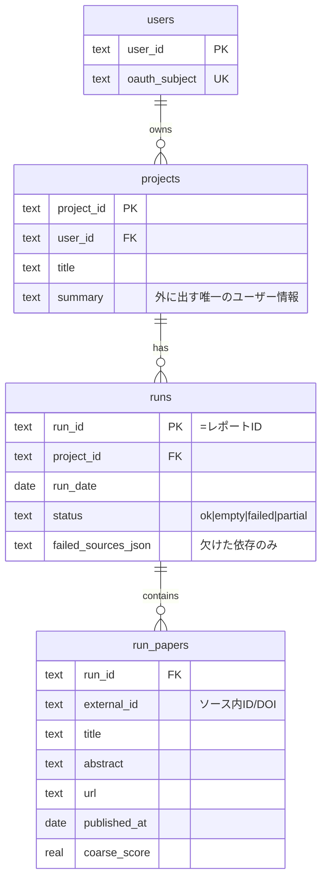
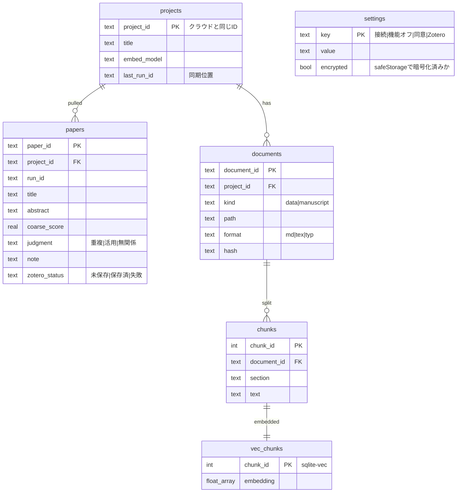

# ER 図

[requirements.md](requirements.md) の FR から必要な表だけを起こす。手段は [ADR 3 本](adr/)。

- 1 プロジェクト = やりたいこと 1 つ
- **クラウド（D1）**: 誰の・どのプロジェクトに・いつ・何が集まったか。公開情報のみ
- **ローカル（SQLite + sqlite-vec）**: 集まった論文への判断と、手元の文章の検索。外に出さない
- 同期はクラウド → ローカルの起動時プルのみ

## FR と表の対応

| FR | 必要なもの | 置き場所 |
|---|---|---|
| FR-01 日次収集 | 実行状態（ok / 0 件 / 失敗） | クラウド `runs` |
| FR-02 重複・活用の報告 | 候補論文＋判定 | `run_papers` / `papers` |
| FR-03 手元データ検索 | 本文断片＋ベクトル | ローカル `chunks` / `vec_chunks` |
| FR-04 ファクトチェック | 原稿（結果保存は未決） | ローカル `documents` |
| FR-06 プロジェクト切替 | プロジェクト | 両方 `projects` |
| FR-07 原稿取り込み | 原稿ファイル | ローカル `documents` |
| FR-09 テーマ候補 | 候補の元 | `papers` から都度生成（保存しない） |
| FR-10 統制下の LLM | 表は不要（BFF の経路で担保） | — |
| C-03 機能の完全オフ | 設定 | ローカル `settings` |

## クラウド（D1）

### 各表の意味

- **`users`**: 使う人。`oauth_subject` は本人確認用。名前・メールは持たない
- **`projects`**: 追いかけている対象。`summary` は日次収集が何を集めるか判断する唯一の材料であり、同時にクラウドに出る唯一のユーザー情報。FR-06 の切替はこの行の切替
- **`runs`**: 収集 1 回の記録。`run_id` がそのままレポート ID。`status` で `empty`（新着なし）と `failed`（取得不能）を区別（FR-01）。`failed_sources_json` により一部失敗時に欠けた部分だけを表示
- **`run_papers`**: その実行で見つかった論文。タイトル・要旨も行に直接持つ（クラウドに `papers` を作らない）。`coarse_score` は `summary` と照らした粗い絞り込み。精密判定は未公開データが要るのでローカルで行う

## ローカル（SQLite + sqlite-vec）

### `settings` に置くキー

| キー | 値 | 秘密 |
|---|---|---|
| `auth.user_id` | クラウド `users.user_id`。ローカルとクラウドの対応づけ | — |
| `auth.account_label` | 表示名（複数アカウントの判別用。不要なら省く） | — |
| `auth.refresh_token_enc` | 更新用トークン。`encrypted=true` | **秘密** |
| `auth.expires_at` | 有効期限 | — |
| `sync.endpoint` | BFF の接続先 | — |
| `sync.last_synced_at` | 最終同期時刻（失敗表示用） | — |
| `feature.*` | 機能の完全オフ（C-03） | — |
| `consent.*` | 外部 LLM への同意とバージョン | — |
| `zotero.mode` | `local` / `web` | — |

- アクセストークンは保存しない（メモリのみ）
- 同期位置は `projects.last_run_id` に持つので `settings` には置かない

### 各表の意味

- **`projects`**: クラウドと同じ `project_id` で対応づける。`last_run_id` は同期位置で、起動時はこれ以降だけ取得。`embed_model` はプロジェクトに 1 つ固定（別モデルのベクトルは比較できないため）
- **`papers`**: `run_papers` を取り込み、手元でしか出せない情報を足した表。`judgment` が FR-02 の中身、`note` はその根拠、`zotero_status` は保存の再試行用
- **`documents`**: 手元のファイル 1 つ。`kind=data`（研究データ）と `kind=manuscript`（執筆中原稿）を同じ表に置くのは、読み込み・分割・検索の扱いが同じため。`hash` は変更時のみ再索引するために使う
- **`chunks`**: 検索できる大きさに切った文章。`section` は根拠提示に使う
- **`vec_chunks`**: `chunks` と 1 対 1 のベクトル。sqlite-vec により同一ファイル・同一トランザクションで扱え、片方だけ更新される食い違いが起きない。中身は外に出さない（C-01）
- **`settings`**: キーと値。クラウド接続（ユーザー識別とトークン）、機能の完全オフ（C-03）、同意、Zotero 接続方法。秘密の値は Electron `safeStorage` で暗号化して入れ、`encrypted` で示す。追加のネイティブ依存を増やさないため（NFR-05）
  - DB ファイル自体は暗号化されない。`safeStorage` は「ファイルを見ただけでは読めない」保護であり、同じ PC の同じユーザー権限で動くプログラムからは復号できる

## 流れ

1. 未起動でもクラウドが `projects.summary` を見て収集し、`runs` / `run_papers` に溜める
2. 起動時、`last_run_id` より後をローカル `papers` に取り込む
3. `chunks` / `vec_chunks` と照らして `judgment` を付ける
4. 結果から Zotero 保存やテーマ候補の生成を行う

## 持たない表と代償

| 持たない | 代わり | 代償 |
|---|---|---|
| クラウド `papers` | `run_papers` に論文情報を直接持つ | 実行ごとに重複。保存量は増えるが結合が減る |
| クラウド `llm_usage` | Workers 側のログ | 利用上限を数えるなら表が必要 |
| `themes` | `papers` から都度生成 | 過去の候補を見返せない |
| `fc_claims` | 保存しない（要件で未決） | 検査結果は画面で見るだけ |
| `zotero_queue` | `papers.zotero_status` | 1 論文 1 リクエストなら足りる |
| `embedding_spaces` | `projects.embed_model` | モデル変更時は再索引 |

## 未決 / 要確認

- 成功条件 3（Zotero 保存）に対応する FR が要件表にない。`papers.zotero_status` はこれを見込んだ仮置き
- ADR-0001 が現存しない ID（FR-08, C-07, NFR-03）を参照している
- ファクトチェック結果の保存可否
- 同意をクラウドに持たないため、BFF の同意判定方法（例: クライアントが同意バージョンを送る）
- ADR-0003 は「取得キーは OS secure storage」。本図はトークンを `safeStorage` 暗号化で `settings` に置くため、Zotero キーも同じ方式に揃えるなら ADR-0003 の修正が必要
- sqlite-vec の Electron 読込と各 OS 配布、件数増加時の検索速度
