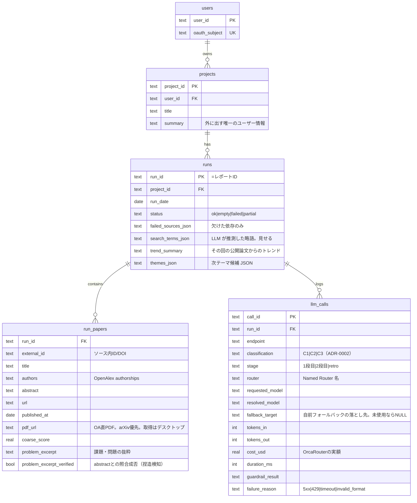
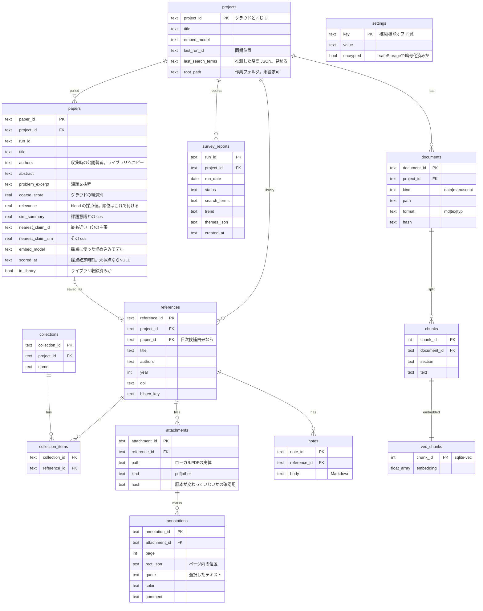

# ER 図

[requirements.md](requirements.md) の FR から必要な表だけを起こす。手段は [ADR](adr/)。

- 1 プロジェクト = やりたいこと 1 つ
- **クラウド（D1）**: 誰の・どのプロジェクトに・いつ・何が集まったか。公開情報のみ
- **ローカル（SQLite + sqlite-vec）**: 集まった論文への判断、手元の文章の検索、PDF と注釈。外に出さない
- 同期はクラウド → ローカルの起動時プルのみ

## FR と表の対応

| FR | 必要なもの | 置き場所 |
|---|---|---|
| FR-01 日次収集 | 実行状態（ok / 0 件 / 失敗） | クラウド `runs` |
| FR-02 関連度順の提示 | 候補論文＋関連度 | `run_papers` / `papers` |
| FR-03 手元データ検索 | 本文断片＋ベクトル | ローカル `chunks` / `vec_chunks` |
| FR-04 ファクトチェック | 原稿（結果保存は未決） | ローカル `documents` |
| FR-05 参考文献ライブラリ | 書誌＋整理 | ローカル `references` / `collections` |
| FR-12 引用ファイル書き出し | 書き出し先と key | `settings` ＋ `references.bibtex_key` |
| FR-06 プロジェクト切替 | プロジェクト | 両方 `projects` |
| FR-07 原稿取り込み | 原稿ファイル | ローカル `documents` |
| FR-08 欠損≠成功 | 実行状態と欠けた依存 | クラウド `runs` |
| FR-09 テーマ候補 | その収集の公開論文から生成し実行行に残す | クラウド `runs.themes_json` / ローカル `survey_reports` |
| FR-10 統制下の LLM | 表は不要（BFF の経路で担保） | — |
| FR-11 CLI | GUI と同一ストア（新表なし） | ローカル全表 |
| FR-13 ローカル関連度付け | 関連度と最近傍の主張（新表なし） | ローカル `papers` |
| FR-14 PDF・注釈・ノート | 添付実体＋注釈＋ノート | ローカル `attachments` / `annotations` / `notes` |
| C-03 機能の完全オフ | 設定 | ローカル `settings` |

## クラウド（D1）

### 各表の意味

- **`users`**: 使う人。`oauth_subject` は本人確認用（`google:{sub}`）。名前・メールは持たない
- **`projects`**: 追いかけている対象。`summary` は日次収集が何を集めるか判断する唯一の材料であり、同時にクラウドに出る唯一のユーザー情報。FR-06 の切替はこの行の切替
- **`runs`**: 収集 1 回の記録。`run_id` がそのままレポート ID（日次は `{project_id}:{日付}`、自発は `{project_id}:manual:{unix}`）。一意は `run_id` のみで同日複数可（FR-17）。`status` で `empty`（新着なし）と `failed`（取得不能）を区別（FR-01）。`failed_sources_json` により一部失敗時に欠けた部分だけを表示。`search_terms_json` は研究背景から LLM が推測した略語で、隠さず同期して見せる（C-07）。`trend_summary` / `themes_json` はその回の公開論文から出した今のトレンドと次テーマ（FR-09）。利用者に渡す論文は粗い順位の上位 5 件
- **`run_papers`**: その実行で見つかった論文。タイトル・著者・要旨も行に直接持つ（クラウドに `papers` を作らない）。`pdf_url` は OpenAlex の location から選んだ https の直 PDF で、**複数あれば arXiv 等の全文リポジトリを優先**する（ADR-0003）。無ければ null＝未取得で、PDF バイトはクラウドに置かない。`coarse_score` は `summary` と照らした粗い絞り込み。`problem_excerpt` は要旨から抜いた課題・問題の文（順位ではない。FR-16）。`problem_excerpt_verified` は `problem_excerpt` が `abstract` に字面で存在するかの照合結果で、捏造率の算出に使う（ADR-0005 §10）。候補論文との精密な順位はローカル（ADR-0001）
- **`llm_calls`**: 1 段目・2 段目・`retro`（内省ループ自身）を含む外部 LLM 呼び出し 1 回の記録（ADR-0005 §8〜§10）。`resolved_model` は Named Router が解決した実モデル、`fallback_target` は自前フォールバックが発生した場合の落とし先。`cost_usd` は `X-OrcaRouter-Include-Cost` で受け取る実額で、OrcaRouter の Request Logs と突合する基礎データ。`failure_reason` はガードレール・形式不正を含む失敗分類

## ローカル（SQLite + sqlite-vec）

### `settings` に置くキー

| キー | 値 | 秘密 |
|---|---|---|
| `auth.user_id` | クラウド `users.user_id`。ローカルとクラウドの対応づけ | — |
| `auth.account_label` | 表示名（複数アカウントの判別用。不要なら省く） | — |
| `auth.refresh_token_enc` | 更新用トークン。`encrypted=true`（OS 保護領域 / `safeStorage`） | **秘密** |
| `auth.expires_at` | 有効期限 | — |
| `sync.endpoint` | BFF の接続先 | — |
| `sync.last_synced_at` | 最終同期時刻（失敗表示用） | — |
| `feature.*` | 機能の完全オフ（C-03） | — |
| `consent.*` | 外部 LLM への同意とバージョン | — |
| `export.bib_path` | 引用ファイルの書き出し先。**未設定なら書き出さない**（FR-12） | — |
| `export.format` | `bibtex` / `hayagriva` | — |

- アクセストークンは保存しない（メモリのみ。メインプロセス）
- 同期位置は `projects.last_run_id` に持つので `settings` には置かない

### 各表の意味

- **`projects`**: クラウドと同じ `project_id` で対応づける。`last_run_id` は同期位置で、起動時はこれ以降だけ取得。`last_search_terms` は直近の収集で LLM が推測した略語。隠さず見せる（C-07）。`embed_model` はプロジェクトに 1 つ固定（別モデルのベクトルは比較できないため）。`root_path` は作業フォルダ（`references` / `mypaper` / `claims`）。未設定のままでもプロジェクト行は作れる。索引の正本は SQLite
- **`survey_reports`**: 収集 1 回の報告。クラウド `runs` のいつ・状態・検索語・トレンド・次テーマを手元に残す。論文は `papers.run_id` で辿る
- **`papers`**: `run_papers` を取り込み、手元でしか出せない情報を足した表。`relevance` が FR-02 の中身で、順位はこれだけで付ける（`blend` = 課題意識 cos × 0.7 ＋ 最近傍の関連技術 cos × 0.3）。**有効／除外の列を持たない**——実データで閾値が引けなかったため、引けないものを持たない（`C-07`）。`nearest_chunk_id` は最も近い関連技術で、最近傍という事実であって判定ではない。採点は 1 件ずつ確定して `scored_at` を入れるので、途中終了しても済んだ分は残り、未採点分が次回の対象になる（再開用のキュー表は要らない。`NFR-06`）。`embed_model` はモデルを替えたら採点し直す必要があることを示す。`in_library` はライブラリ収録済みかの目印
- **`references`**: アプリ内参考文献ライブラリの本体（FR-05）。日次候補から入れた場合は `paper_id` で辿れる。手で足した文献は `paper_id` が空。GUI と CLI が同じこの表を読み書きする（FR-11）。`bibtex_key` は `\cite{}` に使う識別子で、**プロジェクト内で一意**。著者姓＋年で自動生成し、衝突時は英字サフィックスを付ける（FR-12）。この表が引用ファイルの書き出し内容の唯一の元になる
- **`collections` / `collection_items`**: コレクション相当の整理。1 文献を複数コレクションに入れられるよう中間表にする
- **`attachments`**: 文献に添付した PDF の実体への参照（FR-14）。`hash` は原本が外部で差し替えられたときに注釈の位置がずれることを検知するために持つ
- **`annotations`**: ハイライト・注釈。**PDF 本体には書き戻さず DB にだけ持つ**ので、ユーザーが置いた原本のバイト列は変わらない（`C-08`）
- **`notes`**: 文献ごとの自由記述。未公開の思考なので外に出さない（`C-01`）
- **`documents`**: 手元のファイル 1 つ。`kind=data`（研究データ）と `kind=manuscript`（執筆中原稿）を同じ表に置くのは、読み込み・分割・検索の扱いが同じため。`hash` は変更時のみ再索引するために使う
- **`chunks`**: 検索できる大きさに切った文章。`section` は根拠提示に使う
- **`vec_chunks`**: `chunks` と 1 対 1 のベクトル。sqlite-vec により同一ファイル・同一トランザクションで扱え、片方だけ更新される食い違いが起きない。中身は外に出さない（C-01）
- **`settings`**: キーと値。クラウド接続（ユーザー識別とトークン）、機能の完全オフ（C-03）、同意。秘密の値は Electron `safeStorage` で暗号化して入れ、`encrypted` で示す。追加のネイティブ依存を増やさないため（NFR-05）
  - DB ファイル自体は暗号化されない。`safeStorage` は「ファイルを見ただけでは読めない」保護であり、同じ PC の同じユーザー権限で動くプログラムからは復号できる

## 流れ

1. 未起動でもクラウドが `projects.summary` を見て収集し、`runs` / `run_papers` に溜める
2. 起動時、`last_run_id` より後をローカル `papers` に取り込む
3. 課題意識と関連技術のベクトルと照らして `relevance` を付け、順位を出す（外部送信なし。`C-09`）
4. 報告画面でその回のトレンド・次テーマ・論文をまとめて見る。ライブラリ追加は報告から行う
5. CLI は 2〜4 のローカル側と同じストアを直接読み書きする（FR-11）

## 持たない表と代償

| 持たない | 代わり | 代償 |
|---|---|---|
| クラウド `papers` | `run_papers` に論文情報を直接持つ | 実行ごとに重複。保存量は増えるが結合が減る |
| `themes` 表 | `runs.themes_json` / ローカル `survey_reports` | 過去の候補は報告単位で見返せる |
| `fc_claims` | 保存しない（要件で未決） | 検査結果は画面で見るだけ |
| 保存キュー表 | `papers.in_library` | ライブラリはローカルなので再試行が要らない |
| 有効／除外の列 | `papers.relevance` の順位のみ | 後から線を引きたくなったとき根拠がない |
| 採点履歴表 | `papers` の現在値のみ | 採点し直すと前回の順位が消える |
| 採点キュー表 | `scored_at IS NULL` の行を拾う | 優先順・再試行回数を持てない |
| 書き出し状態表 | マーカー内を毎回再生成 | 差分を持たない代わりに、書き出しは全置換になる |
| `embedding_spaces` | `projects.embed_model` | モデル変更時は再索引 |

## 未決 / 要確認

- ファクトチェック結果の保存可否（`fc_claims` の要否）
- 同意をクラウドに持たないため、BFF の同意判定方法（例: クライアントが同意バージョンを送る）
- 既定で何件を見せるか（実測 34 % は n=50 の値）と、原稿の本文チャンクを採点に使うか
- 添付 PDF の置き場は作業フォルダの `references/`。利用者が置いたパスはそのまま。OA 取得分だけここに足す（ADR-0003）
- 引用スタイル（CSL）をどこまで持つか
- CSL スタイル対応と他マネージャからの移行
- 書き出し先の指定 UX（原稿から自動推測するか、明示設定のみか）
- CLI のコマンド粒度（ライブラリのみか、FC／テーマまで出すか）
- sqlite-vec の Electron 読込と各 OS 配布、件数増加時の検索速度
