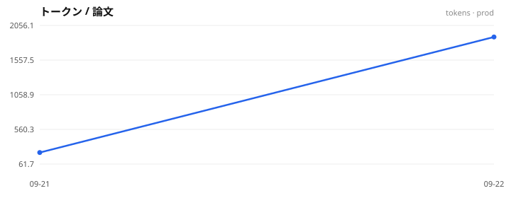
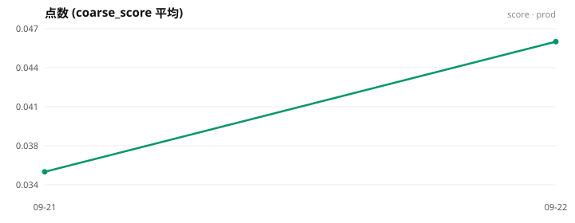
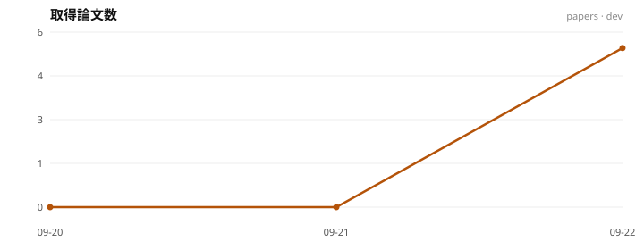
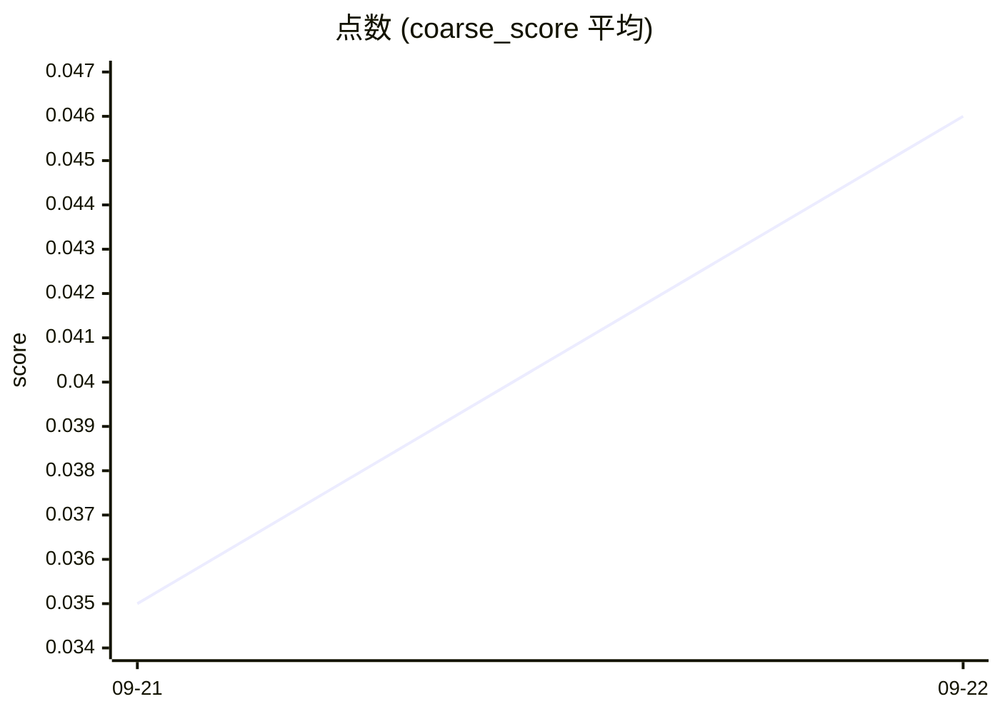

# 指標レポート

トークン/見つけた論文と点数（`coarse_score` 平均）。
環境: `prod` / 収集 status: `ok` / 更新: 2026-09-22T02:00Z。

> 数値と SVG グラフは \`scripts/retro-metrics.mjs\` / \`render-charts-svg.mjs\`（決定的）。
> 上のまとめ文は Claude（\`metrics-report\`）。無い改善は書いていない（`C-07`）。

## 今回なにをしたか

PR [#57](https://github.com/uzak0209/AI-Research/pull/57): feat: 候補の時点で書誌を揃え、1 日の LLM 上限を 100 にする

## 指標はどう動いたか

Claude のまとめはスキップされた。下のグラフと明細を直接読むこと。

## いま言えること / 言えないこと

文章の要約は無し。数値は決定的スクリプトの結果のみ。

---

## グラフ







---

## トークン/論文と点数の推移（prod / 直近 14 日）

### 主指標

| 指標 | 前半平均 | 後半平均 | 変化 | n |
|---|---:|---:|---:|---:|
| トークン/論文 ※低い方が良い | — | — | 母数不足 | 2 |
| 点数 (coarse_score 平均) ※高い方が良い | — | — | 母数不足 | 2 |
| 取得論文数（絶対値） | — | — | 母数不足 | 2 |

> トークン/論文の改善は確認できていない。
> 点数の比較はできない（採点付き論文の日が足りない）。

母数: 比較 2 日 / 採点あり 2 日 / データのある 2 日 / 呼び出し 43 回 / 論文 320 本（うち採点 320）。
n が小さいうちは傾向として読まないこと。

### グラフ

```mermaid
xychart-beta
    title "トークン / 論文"
    x-axis ["09-21", "09-22"]
    y-axis "tokens" 98.2 --> 1655.0
    line [227.9, 1525.3]
```



```mermaid
xychart-beta
    title "取得論文数"
    x-axis ["09-21", "09-22"]
    y-axis "papers" 0 --> 340
    line [310, 10]
```

### 明細

| 日付 | 呼出 | トークン | 論文 | 採点本数 | トークン/論文 | 点数 | run |
|---|---:|---:|---:|---:|---:|---:|---|
| 2026-09-21 | 23 | 70647 | 310 | 310 | 227.89 | 0.035 | ok:8 empty:3 |
| 2026-09-22 | 20 | 15253 | 10 | 10 | 1525.30 | 0.046 | ok:2 |

`—` は割れなかった／採点が無かった日。0 で埋めていない。

